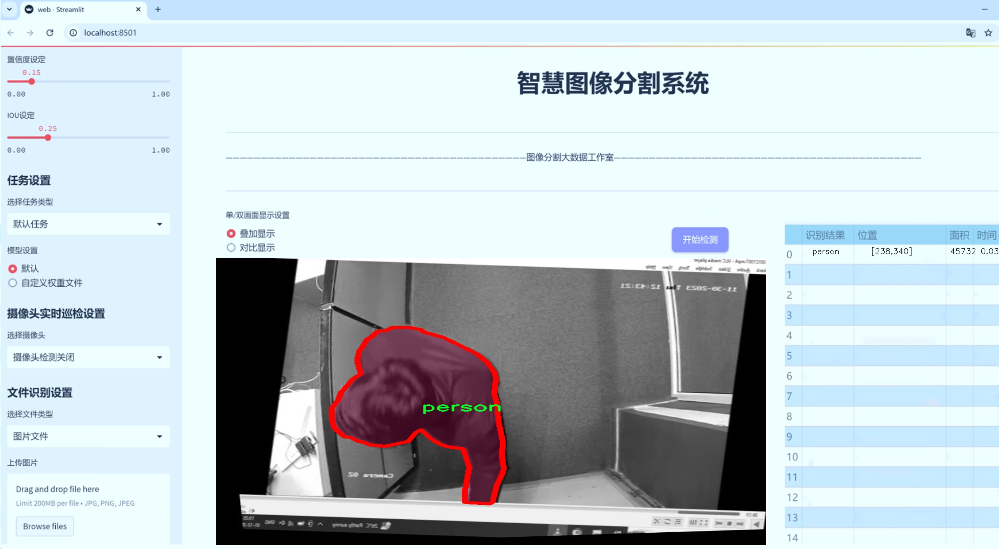
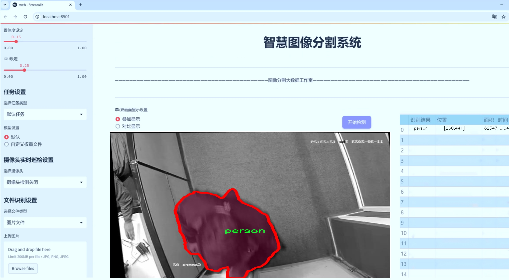
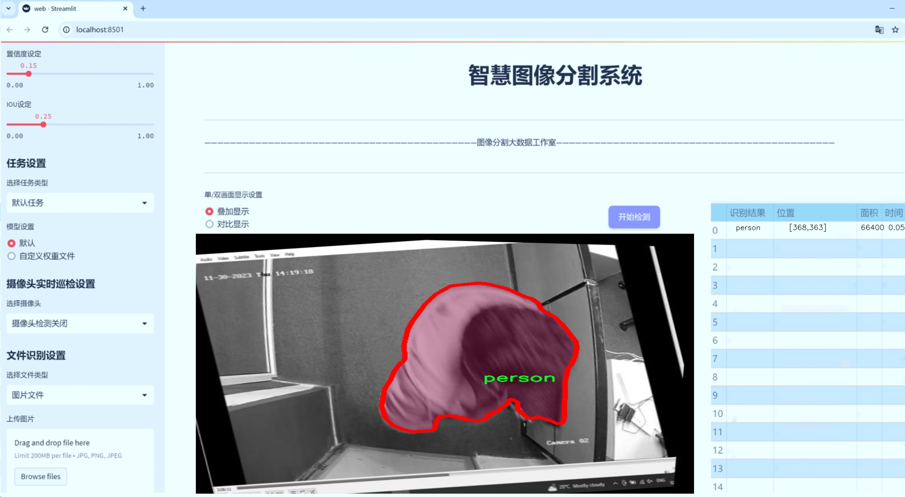
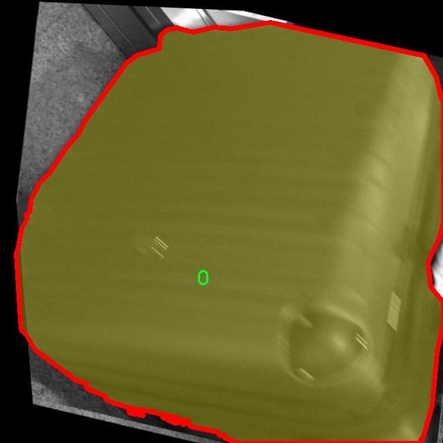
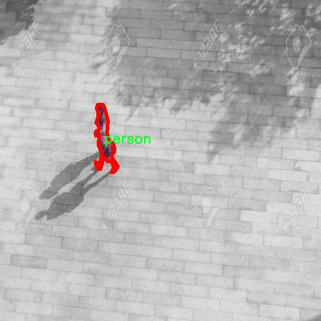
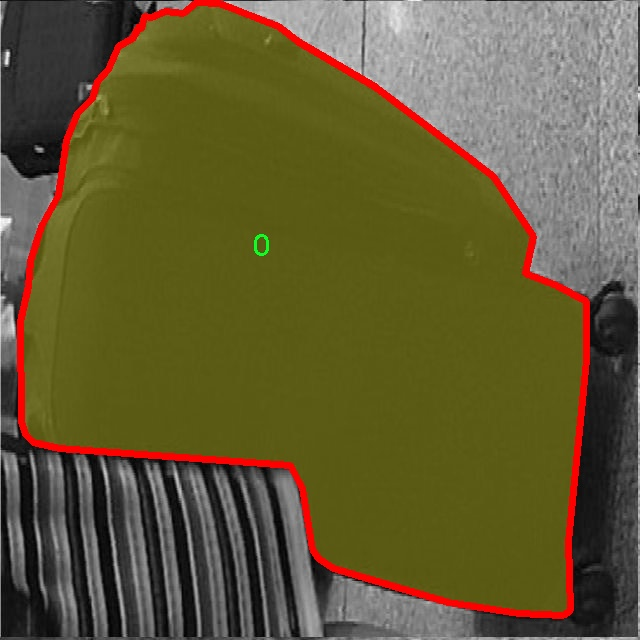
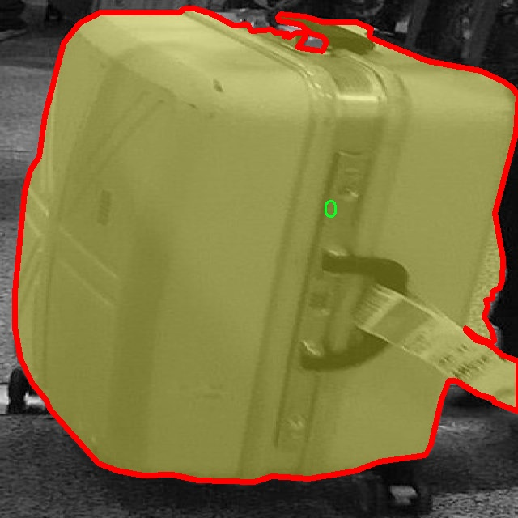
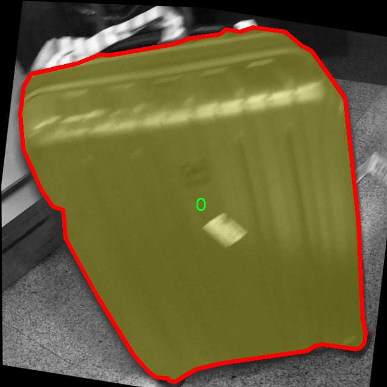

# 行人检测与分割系统源码＆数据集分享
 [yolov8-seg-C2f-DLKA＆yolov8-seg-C2f-CloAtt等50+全套改进创新点发刊_一键训练教程_Web前端展示]

### 1.研究背景与意义

项目参考[ILSVRC ImageNet Large Scale Visual Recognition Challenge](https://gitee.com/YOLOv8_YOLOv11_Segmentation_Studio/projects)

项目来源[AAAI Global Al lnnovation Contest](https://kdocs.cn/l/cszuIiCKVNis)

研究背景与意义

随着城市化进程的加快，行人安全问题日益凸显，尤其是在交通繁忙的城市环境中，行人事故频发，给社会带来了严重的安全隐患。因此，行人检测与分割技术的研究显得尤为重要。行人检测不仅是计算机视觉领域的一个重要研究方向，也是智能交通系统、自动驾驶、监控系统等应用的基础。传统的行人检测方法往往依赖于手工特征提取，难以适应复杂多变的环境，且在实时性和准确性上存在局限性。近年来，深度学习技术的迅猛发展为行人检测与分割提供了新的解决方案，尤其是基于卷积神经网络（CNN）的目标检测算法，如YOLO（You Only Look Once）系列模型，因其高效性和准确性而受到广泛关注。

YOLOv8作为YOLO系列的最新版本，继承了前几代模型的优点，并在性能上进行了显著提升。其在目标检测中的实时性和高精度，使其成为行人检测与分割任务的理想选择。然而，尽管YOLOv8在多种场景下表现出色，但在特定环境下，尤其是行人密集、遮挡严重的情况下，仍然面临检测精度不足的问题。因此，针对YOLOv8进行改进，以提高其在行人检测与分割中的表现，具有重要的研究意义。

本研究将基于“prsn_all 3”数据集进行行人检测与分割系统的构建。该数据集包含1400张图像，涵盖了4个类别，其中包括“person”和“person with backpack”。这些类别的划分不仅丰富了行人检测的语义信息，也为模型的训练提供了多样化的样本。这种多样性使得模型能够更好地适应不同场景下的行人特征，尤其是在行人携带物品时的检测与分割任务。通过对该数据集的深入分析和处理，可以为改进YOLOv8模型提供必要的训练和验证基础。

在实际应用中，行人检测与分割系统不仅可以提高交通监控的智能化水平，还可以为智能驾驶系统提供更为精准的行人信息，从而提升行车安全。此外，该系统在公共安全、安防监控等领域也具有广泛的应用前景。通过改进YOLOv8的行人检测与分割能力，可以有效降低行人事故发生率，提高行人安全保障水平。

综上所述，基于改进YOLOv8的行人检测与分割系统的研究，不仅具有重要的理论价值，也具备广泛的应用前景。通过本研究的开展，期望能够推动行人检测与分割技术的发展，为相关领域的研究提供新的思路和方法，为构建更安全的城市环境贡献力量。

### 2.图片演示







##### 注意：由于此博客编辑较早，上面“2.图片演示”和“3.视频演示”展示的系统图片或者视频可能为老版本，新版本在老版本的基础上升级如下：（实际效果以升级的新版本为准）

  （1）适配了YOLOV8的“目标检测”模型和“实例分割”模型，通过加载相应的权重（.pt）文件即可自适应加载模型。

  （2）支持“图片识别”、“视频识别”、“摄像头实时识别”三种识别模式。

  （3）支持“图片识别”、“视频识别”、“摄像头实时识别”三种识别结果保存导出，解决手动导出（容易卡顿出现爆内存）存在的问题，识别完自动保存结果并导出到tempDir中。

  （4）支持Web前端系统中的标题、背景图等自定义修改，后面提供修改教程。

  另外本项目提供训练的数据集和训练教程,暂不提供权重文件（best.pt）,需要您按照教程进行训练后实现图片演示和Web前端界面演示的效果。

### 3.视频演示

[3.1 视频演示](https://www.bilibili.com/video/BV1LVyVYmEqG/)

### 4.数据集信息展示

##### 4.1 本项目数据集详细数据（类别数＆类别名）

nc: 4
names: ['0', '1', 'person', 'person with backpack']


##### 4.2 本项目数据集信息介绍

数据集信息展示

在本研究中，我们采用了名为“prsn_all 3”的数据集，以支持对YOLOv8-seg模型在行人检测与分割任务中的改进。该数据集专门设计用于行人相关的图像分析，具有良好的多样性和丰富的标注信息，能够有效提升模型的性能和准确性。数据集包含四个类别，分别为“0”、“1”、“person”和“person with backpack”。这些类别的设置不仅考虑了行人的基本形态，还涵盖了特定场景下的复杂情况，例如背包的存在，这对于实际应用中的行人识别具有重要意义。

在“prsn_all 3”数据集中，类别“0”和“1”可能代表一些背景或非目标对象，这为模型提供了一个清晰的对比基础，使其能够更好地学习到行人与其他物体之间的区别。通过将这些类别纳入训练，模型可以在不同环境下更有效地进行目标检测，降低误检率，提高整体的检测精度。尤其是在复杂的场景中，行人与背景的区分显得尤为重要，这对于后续的分割任务也起到了积极的促进作用。

类别“person”是数据集的核心，涵盖了各种姿态、服装和场景下的行人图像。这一类别的多样性确保了模型在不同条件下的鲁棒性，能够适应各种实际应用场景，例如城市监控、智能交通系统等。通过对这一类别的充分训练，YOLOv8-seg模型将能够更准确地识别行人，并在分割任务中实现更高的精度。

此外，类别“person with backpack”则为模型提供了额外的挑战和学习机会。背包的存在可能会影响行人的外观特征，导致传统的检测算法出现误判。通过将这一类别纳入训练，模型能够学习到如何在行人携带物品的情况下进行准确的检测与分割。这一能力在实际应用中具有重要意义，尤其是在公共场所或交通繁忙的环境中，行人可能会携带各种物品，模型的适应性和准确性直接影响到系统的实用性。

综上所述，“prsn_all 3”数据集不仅为YOLOv8-seg模型的训练提供了丰富的样本和多样的类别，还通过合理的类别设计增强了模型在行人检测与分割任务中的表现。通过对这一数据集的深入分析与应用，我们期望能够显著提升模型的检测精度和分割效果，为行人识别技术的发展贡献一份力量。在未来的研究中，我们将继续探索如何进一步优化数据集的使用，结合先进的算法和技术，推动行人检测与分割领域的进步。











### 5.全套项目环境部署视频教程（零基础手把手教学）

[5.1 环境部署教程链接（零基础手把手教学）](https://www.bilibili.com/video/BV1jG4Ve4E9t/?vd_source=bc9aec86d164b67a7004b996143742dc)


[5.2 安装Python虚拟环境创建和依赖库安装视频教程链接（零基础手把手教学）](https://www.bilibili.com/video/BV1nA4VeYEze/?vd_source=bc9aec86d164b67a7004b996143742dc)

### 6.手把手YOLOV8-seg训练视频教程（零基础小白有手就能学会）

[6.1 手把手YOLOV8-seg训练视频教程（零基础小白有手就能学会）](https://www.bilibili.com/video/BV1cA4VeYETe/?vd_source=bc9aec86d164b67a7004b996143742dc)


按照上面的训练视频教程链接加载项目提供的数据集，运行train.py即可开始训练



     Epoch   gpu_mem       box       obj       cls    labels  img_size
     1/200     0G   0.01576   0.01955  0.007536        22      1280: 100%|██████████| 849/849 [14:42<00:00,  1.04s/it]
               Class     Images     Labels          P          R     mAP@.5 mAP@.5:.95: 100%|██████████| 213/213 [01:14<00:00,  2.87it/s]
                 all       3395      17314      0.994      0.957      0.0957      0.0843

     Epoch   gpu_mem       box       obj       cls    labels  img_size
     2/200     0G   0.01578   0.01923  0.007006        22      1280: 100%|██████████| 849/849 [14:44<00:00,  1.04s/it]
               Class     Images     Labels          P          R     mAP@.5 mAP@.5:.95: 100%|██████████| 213/213 [01:12<00:00,  2.95it/s]
                 all       3395      17314      0.996      0.956      0.0957      0.0845

     Epoch   gpu_mem       box       obj       cls    labels  img_size
     3/200     0G   0.01561    0.0191  0.006895        27      1280: 100%|██████████| 849/849 [10:56<00:00,  1.29it/s]
               Class     Images     Labels          P          R     mAP@.5 mAP@.5:.95: 100%|███████   | 187/213 [00:52<00:00,  4.04it/s]
                 all       3395      17314      0.996      0.957      0.0957      0.0845


### 7.50+种全套YOLOV8-seg创新点代码加载调参视频教程（一键加载写好的改进模型的配置文件）

[7.1 50+种全套YOLOV8-seg创新点代码加载调参视频教程（一键加载写好的改进模型的配置文件）](https://www.bilibili.com/video/BV1Hw4VePEXv/?vd_source=bc9aec86d164b67a7004b996143742dc)

### 8.YOLOV8-seg图像分割算法原理

原始YOLOV8-seg算法原理

YOLOv8-seg算法是由Ultralytics公司于2023年推出的最新一代YOLO系列模型，旨在解决计算机视觉领域中的目标检测与实例分割任务。YOLOv8不仅在精度和执行速度上超越了其前身YOLOv5、YOLOv6和YOLOX等模型，还在结构设计上进行了多项创新，尤其是在小目标检测和高分辨率图像处理方面展现了其强大的能力。本文将详细探讨YOLOv8-seg算法的原理及其在实例分割中的应用。

YOLOv8-seg算法的核心在于其独特的网络结构设计。首先，YOLOv8采用了C2f模块来替代YOLOv5中的C3模块，这一变化不仅提升了特征提取的效率，还增强了模型的表达能力。C2f模块通过引入更多的跳层连接和Split操作，使得信息在网络中能够更为高效地流动，减少了信息的损失。这种设计理念使得YOLOv8在处理复杂场景时，能够更好地捕捉到细节特征，从而提高了分割精度。

在主干网络方面，YOLOv8采用了CSP（Cross Stage Partial）结构，将特征提取过程分为两个部分，分别进行卷积和连接。这种结构的优势在于能够有效减轻梯度消失的问题，并且通过特征的重用来提升模型的学习能力。此外，YOLOv8在末尾引入了SPPF（Spatial Pyramid Pooling Fast）模块，这一模块的设计目的在于提升模型的计算速度，使得YOLOv8在实时应用中能够保持高效的处理能力。

YOLOv8的颈部网络采用了PAN-FPN（Path Aggregation Network - Feature Pyramid Network）结构，旨在实现特征的多尺度融合。PAN-FPN通过自底向上的路径和自顶向下的路径结合，使得不同尺度的特征能够在网络中得到有效的整合。这一特性对于实例分割任务尤为重要，因为分割任务通常需要对不同大小的目标进行精确的边界识别。通过这种多尺度特征融合，YOLOv8能够在处理复杂场景时，保持高的分割精度。

在检测网络的设计上，YOLOv8采用了Anchor-Free的检测方式，显著简化了目标检测的过程。传统的Anchor-Based方法需要手动设置锚框，而YOLOv8通过解耦头结构，直接从特征图中预测目标的类别和位置。这一创新不仅提高了模型的灵活性，还减少了对先验知识的依赖，使得模型在不同场景下的适应性更强。此外，YOLOv8引入了新的损失函数CloU（Class-oriented Loss），这一损失函数在训练过程中能够更好地平衡类别间的差异，从而提升模型的整体性能。

YOLOv8-seg算法在处理实例分割任务时，能够通过其强大的特征提取和融合能力，准确地识别和分割出图像中的目标。其结构设计的灵活性和高效性，使得YOLOv8在各种硬件平台上均能良好运行，无论是CPU还是GPU，都能够实现实时的目标检测与分割。这一特性使得YOLOv8在智能监控、自动驾驶、医疗影像分析等多个领域具有广泛的应用前景。

在实际应用中，YOLOv8-seg算法展现出了卓越的性能。例如，在垃圾分类任务中，YOLOv8能够快速而准确地识别出不同类型的垃圾，并进行精确的分割。这一能力不仅提高了垃圾分类的效率，也为环境保护提供了技术支持。通过YOLOv8的实时检测与分割，相关部门能够更好地管理和处理垃圾，从而实现可持续发展目标。

总的来说，YOLOv8-seg算法通过一系列创新的结构设计和高效的特征处理方法，成功地提升了目标检测与实例分割的性能。其在实时性、精度和适应性方面的优势，使得YOLOv8成为计算机视觉领域中的一颗璀璨明珠。随着技术的不断进步，YOLOv8的应用前景将更加广阔，未来在更多复杂场景中的应用将进一步推动智能视觉技术的发展。


### 9.系统功能展示（检测对象为举例，实际内容以本项目数据集为准）

图9.1.系统支持检测结果表格显示

  图9.2.系统支持置信度和IOU阈值手动调节

  图9.3.系统支持自定义加载权重文件best.pt(需要你通过步骤5中训练获得)

  图9.4.系统支持摄像头实时识别

  图9.5.系统支持图片识别

  图9.6.系统支持视频识别

  图9.7.系统支持识别结果文件自动保存

  图9.8.系统支持Excel导出检测结果数据


### 10.50+种全套YOLOV8-seg创新点原理讲解（非科班也可以轻松写刊发刊，V11版本正在科研待更新）

#### 10.1 由于篇幅限制，每个创新点的具体原理讲解就不一一展开，具体见下列网址中的创新点对应子项目的技术原理博客网址【Blog】：


[10.1 50+种全套YOLOV8-seg创新点原理讲解链接](https://gitee.com/qunmasj/good)

#### 10.2 部分改进模块原理讲解(完整的改进原理见上图和技术博客链接)【如果此小节的图加载失败可以通过CSDN或者Github搜索该博客的标题访问原始博客，原始博客图片显示正常】
### 可变性卷积DCN简介
卷积神经网络由于其构建模块中固定的几何结构，本质上受限于模型几何变换。为了提高卷积神经网络的转换建模能力，《Deformable Convolutional Networks》作者提出了两个模块：可变形卷积（deformable convolution）和可变形RoI池（deformable RoI pooling）。这两个模块均基于用额外的偏移来增加模块中的空间采样位置以及从目标任务中学习偏移的思想，而不需要额外的监督。

第一次证明了在深度神经网络中学习密集空间变换（dense spatial transformation）对于复杂的视觉任务是有效的

视觉识别中的一个关键挑战是如何适应对象比例、姿态、视点和零件变形中的几何变化或模型几何变换。一般有两种方法实现：
1）建立具有足够期望变化的训练数据集。这通常通过增加现有的数据样本来实现，例如通过仿射变换。但是训练成本昂贵而且模型参数庞大。
2）使用变换不变（transformation-invariant）的特征和算法。比如比较有名的SIFT(尺度不变特征变换)便是这一类的代表算法。

但以上的方法有两个缺点：
1）几何变换被假定为固定的和已知的，这些先验知识被用来扩充数据，设计特征和算法。为此，这个假设阻止了对具有未知几何变换的新任务的推广，从而导致这些几何变换可能没有被正确建模。
2）对于不变特征和算法进行手动设计，对于过于复杂的变换可能是困难的或不可行的。

卷积神经网络本质上局限于模拟大型未知转换。局限性源于CNN模块的固定几何结构：卷积单元在固定位置对输入特征图进行采样；池化层以固定比率降低特征矩阵分辨率；RoI（感兴趣区域）池化层将RoI分成固定的空间箱（spatial bins）等。缺乏处理几何变换的内部机制。

这种内部机制的缺乏会导致一些问题，举个例子。同一个CNN层中所有激活单元的感受野大小是相同的，但是这是不可取的。因为不同的位置可能对应于具有不同尺度或变形的对象，所以尺度或感受野大小的自适应确定对于具有精细定位的视觉识别是渴望的。

对于这些问题，作者提出了两个模块提高CNNs对几何变换建模的能力。


deformable convolution（可变形卷积）
将2D偏移量添加到标准卷积中的常规网格采样位置，使得采样网格能够自由变形。通过额外的卷积层，从前面的特征映射中学习偏移。因此，变形采用局部、密集和自适应的方式取决于输入特征。


deformable RoI pooling（可变形RoI池化）
为先前RoI池化的常规库（bin）分区中的每个库位置（bin partition）增加了一个偏移量。类似地，偏移是从前面的特征图和感兴趣区域中学习的，从而能够对具有不同形状的对象进行自适应部件定位（adaptive part localization）。

#### Deformable Convolutional Networks
Deformable Convolution
2D卷积由两个步骤组成：
1）在输入特征图x xx上使用规则网格R RR进行采样。
2）把这些采样点乘不同权重w ww后相加。

网格R定义感受野大小和扩张程度，比如内核大小为3x3，扩张程度为1的网格R可以表示为：
R = { ( − 1 , − 1 ) , ( − 1 , 0 ) , … , ( 0 , 1 ) , ( 1 , 1 ) } R = \{(-1,-1),(-1,0),\dots,(0,1),(1,1)\}
R={(−1,−1),(−1,0),…,(0,1),(1,1)}

​
 一般为小数，使用双线性插值进行处理。（把小数坐标分解到相邻的四个整数坐标点来计算结果）


具体操作如图所示：


首先对输入特征层进行一个普通的3x3卷积处理得到偏移域（offset field）。偏移域特征图具有与输入特征图相同的空间分辨率，channels维度2N对应于N个2D（xy两个方向）偏移。其中的N是原输入特征图上所具有的N个channels，也就是输入输出channels保持不变，这里xy两个channels分别对输出特征图上的一个channels进行偏移。确定采样点后就通过与相对应的权重w点乘相加得到输出特征图上该点最终值。

前面也提到过，由于这里xy两个方向所训练出来的偏移量一般来说是一个小数，那么为了得到这个点所对应的数值，会采用双线性插值的方法，从最近的四个邻近坐标点中计算得到该偏移点的数值，公式如下：


具体推理过程见：双线性插值原理

#### Deformable RoI Poolingb
所有基于区域提议（RPN）的对象检测方法都使用RoI池话处理，将任意大小的输入矩形区域转换为固定大小的特征图。


 一般为小数，需要使用双线性插值进行处理。


具体操作如图所示：


当时看这个部分的时候觉得有些突兀，明明RoI池化会将特征层转化为固定尺寸的区域。其实，我个人觉得，这个部分与上述的可变性卷积操作是类似的。这里同样是使用了一个普通的RoI池化操作，进行一些列处理后得到了一个偏移域特征图，然后重新作用于原来的w × H w \times Hw×H的RoI。只不过这里不再是规律的逐行逐列对每个格子进行池化，而是对于格子进行偏移后再池化处理。

#### Postion﹣Sensitive RoI Pooling
除此之外，论文还提出一种PS RoI池化（Postion﹣Sensitive RoI Pooling）。不同于上述可变形RoI池化中的全连接过程，这里使用全卷积替换。

具体操作如图所示：


首先，对于原来的特征图来说，原本是将输入特征图上的RoI区域分成k × k k\times kk×k个bin。而在这里，则是将输入特征图进行卷积操作，分别得到一个channels为k 2 ( C + 1 ) k^{2}(C+1)k (C+1)的得分图（score maps）和一个channels为2 k 2 ( C + 1 ) 2k{2}(C+1)2k 2 (C+1)的偏移域（offset fields），这两个特征矩阵的宽高是与输入特征矩阵相同的。其中，得分图的channels中，k × k k \times kk×k分别表示的是每一个网格，C CC表示的检测对象的类别数目，1表示背景。而在偏移域中的2表示xy两个方向的偏移。
也就是说，在PS RoI池化中，对于RoI的每一个网格都独自占一个通道形成一层得分图，然后其对于的偏移量占两个通道。offset fields得到的偏移是归一化后的偏移，需要通过和deformable RoI pooling中一样的变换方式得到∆ p i j ∆p_{ij}∆p ij，然后对每层得分图进行偏移池化处理。最后处理完的结果就对应着最后输出的一个网格。所以其包含了位置信息。

原文论述为：


#### Understanding Deformable ConvNets
当可变形卷积叠加时，复合变形的效果是深远的。如图所示：


ps：a是标准卷积的固定感受野，b是可变形卷积的适应性感受野。

感受野和标准卷积中的采样位置在整个顶部特征图上是固定的(左)。在可变形卷积中，它们根据对象的比例和形状进行自适应调整(右)。


### 11.项目核心源码讲解（再也不用担心看不懂代码逻辑）

#### 11.1 ui.py

以下是对代码的核心部分进行提炼和详细注释的版本：

```python
import sys  # 导入sys模块，用于访问与Python解释器相关的变量和函数
import subprocess  # 导入subprocess模块，用于执行外部命令

def run_script(script_path):
    """
    使用当前 Python 环境运行指定的脚本。

    Args:
        script_path (str): 要运行的脚本路径

    Returns:
        None
    """
    # 获取当前 Python 解释器的路径
    python_path = sys.executable

    # 构建运行命令，使用streamlit运行指定的脚本
    command = f'"{python_path}" -m streamlit run "{script_path}"'

    # 执行命令
    result = subprocess.run(command, shell=True)  # 运行命令并等待其完成
    if result.returncode != 0:  # 检查命令的返回码
        print("脚本运行出错。")  # 如果返回码不为0，表示运行出错，打印错误信息

# 实例化并运行应用
if __name__ == "__main__":
    # 指定要运行的脚本路径
    script_path = "web.py"  # 这里直接指定脚本名称，假设在当前目录下

    # 运行脚本
    run_script(script_path)  # 调用run_script函数，传入脚本路径
```

### 代码分析
1. **模块导入**：
   - `sys`模块用于获取当前Python解释器的路径。
   - `subprocess`模块用于执行外部命令。

2. **`run_script`函数**：
   - 该函数接收一个脚本路径作为参数，并使用当前Python环境运行该脚本。
   - 通过`sys.executable`获取当前Python解释器的路径。
   - 构建命令字符串，使用`streamlit`模块运行指定的脚本。
   - 使用`subprocess.run`执行命令，并检查返回码以判断脚本是否成功运行。

3. **主程序执行**：
   - 在`__main__`模块中，指定要运行的脚本路径，并调用`run_script`函数来执行该脚本。

这个文件名为 `ui.py`，它的主要功能是通过当前的 Python 环境来运行一个指定的脚本，具体是一个名为 `web.py` 的文件。代码中首先导入了必要的模块，包括 `sys`、`os` 和 `subprocess`，以及一个自定义的 `abs_path` 函数，用于获取文件的绝对路径。

在 `run_script` 函数中，首先获取当前 Python 解释器的路径，这通过 `sys.executable` 实现。接着，构建一个命令字符串，该命令用于调用 `streamlit` 运行指定的脚本。`streamlit` 是一个用于构建数据应用的框架，命令的格式是将 Python 解释器与 `-m streamlit run` 结合，后面跟上要运行的脚本路径。

使用 `subprocess.run` 函数来执行这个命令，并且设置 `shell=True` 以便在 shell 环境中运行命令。执行后，检查返回的结果，如果返回码不为零，表示脚本运行过程中出现了错误，程序会输出一条错误信息。

在文件的最后部分，使用 `if __name__ == "__main__":` 来确保当这个文件作为主程序运行时，才会执行后面的代码。这里指定了要运行的脚本路径为 `web.py`，并调用 `run_script` 函数来执行这个脚本。

总体来说，这个文件的作用是提供一个简单的接口，通过 Python 环境来运行一个 Streamlit 应用脚本，便于用户在命令行中启动 Web 应用。

#### 11.2 ultralytics\utils\instance.py

以下是经过简化和注释的核心代码部分，主要集中在 `Bboxes` 和 `Instances` 类的实现上。

```python
import numpy as np

class Bboxes:
    """
    处理边界框的类，支持多种格式（'xyxy', 'xywh', 'ltwh'）。
    """

    def __init__(self, bboxes, format='xyxy') -> None:
        """
        初始化 Bboxes 类，接受边界框数据和格式。
        
        参数:
            bboxes (numpy.ndarray): 边界框数据，形状为 [N, 4]。
            format (str): 边界框格式，默认为 'xyxy'。
        """
        # 验证格式是否合法
        assert format in ['xyxy', 'xywh', 'ltwh'], f'无效的边界框格式: {format}'
        # 确保 bboxes 是二维数组
        bboxes = bboxes[None, :] if bboxes.ndim == 1 else bboxes
        assert bboxes.ndim == 2 and bboxes.shape[1] == 4
        self.bboxes = bboxes  # 存储边界框
        self.format = format  # 存储格式

    def convert(self, format):
        """将边界框格式转换为指定格式。"""
        assert format in ['xyxy', 'xywh', 'ltwh'], f'无效的边界框格式: {format}'
        if self.format == format:
            return  # 如果格式相同，则不需要转换
        # 根据当前格式和目标格式选择转换函数
        func = self._get_conversion_function(format)
        self.bboxes = func(self.bboxes)  # 转换边界框
        self.format = format  # 更新格式

    def _get_conversion_function(self, format):
        """根据当前格式和目标格式返回相应的转换函数。"""
        if self.format == 'xyxy':
            return xyxy2xywh if format == 'xywh' else xyxy2ltwh
        elif self.format == 'xywh':
            return xywh2xyxy if format == 'xyxy' else xywh2ltwh
        else:
            return ltwh2xyxy if format == 'xyxy' else ltwh2xywh

    def areas(self):
        """计算并返回每个边界框的面积。"""
        self.convert('xyxy')  # 转换为 'xyxy' 格式以计算面积
        return (self.bboxes[:, 2] - self.bboxes[:, 0]) * (self.bboxes[:, 3] - self.bboxes[:, 1])  # 计算面积

class Instances:
    """
    存储图像中检测到的对象的边界框、分段和关键点的容器。
    """

    def __init__(self, bboxes, segments=None, keypoints=None, bbox_format='xywh', normalized=True) -> None:
        """
        初始化 Instances 类，接受边界框、分段和关键点数据。
        
        参数:
            bboxes (ndarray): 边界框数据，形状为 [N, 4]。
            segments (list | ndarray): 对象分段数据，默认为 None。
            keypoints (ndarray): 关键点数据，形状为 [N, 17, 3]，默认为 None。
            bbox_format (str): 边界框格式，默认为 'xywh'。
            normalized (bool): 是否为归一化坐标，默认为 True。
        """
        self._bboxes = Bboxes(bboxes=bboxes, format=bbox_format)  # 初始化边界框
        self.keypoints = keypoints  # 存储关键点
        self.normalized = normalized  # 存储归一化标志

        # 处理分段数据
        if segments is None:
            segments = []
        if len(segments) > 0:
            segments = resample_segments(segments)  # 重采样分段
            self.segments = np.stack(segments, axis=0)  # 转换为数组
        else:
            self.segments = np.zeros((0, 1000, 2), dtype=np.float32)  # 默认分段为空

    def convert_bbox(self, format):
        """转换边界框格式。"""
        self._bboxes.convert(format=format)

    @property
    def bbox_areas(self):
        """计算边界框的面积。"""
        return self._bboxes.areas()

    def scale(self, scale_w, scale_h, bbox_only=False):
        """按比例缩放边界框、分段和关键点。"""
        self._bboxes.mul(scale=(scale_w, scale_h, scale_w, scale_h))  # 缩放边界框
        if not bbox_only:
            self.segments[..., 0] *= scale_w  # 缩放分段
            self.segments[..., 1] *= scale_h
            if self.keypoints is not None:
                self.keypoints[..., 0] *= scale_w  # 缩放关键点
                self.keypoints[..., 1] *= scale_h

    def __getitem__(self, index) -> 'Instances':
        """
        使用索引获取特定实例或实例集。
        
        参数:
            index (int, slice, or np.ndarray): 索引或布尔数组，用于选择所需实例。
        
        返回:
            Instances: 包含所选边界框、分段和关键点的新 Instances 对象。
        """
        segments = self.segments[index] if len(self.segments) else self.segments
        keypoints = self.keypoints[index] if self.keypoints is not None else None
        bboxes = self.bboxes[index]
        bbox_format = self._bboxes.format
        return Instances(
            bboxes=bboxes,
            segments=segments,
            keypoints=keypoints,
            bbox_format=bbox_format,
            normalized=self.normalized,
        )
```

### 代码说明：
1. **Bboxes 类**：用于处理边界框，支持多种格式（'xyxy', 'xywh', 'ltwh'）。提供了初始化、格式转换、面积计算等功能。
2. **Instances 类**：用于存储图像中检测到的对象的边界框、分段和关键点。提供了初始化、格式转换、缩放、索引获取等功能。
3. **注释**：详细说明了每个方法的功能、参数和返回值，便于理解代码的逻辑和用途。

这个程序文件是一个用于处理边界框（bounding boxes）的工具类，主要用于计算机视觉任务中，特别是在目标检测中。文件中定义了两个主要的类：`Bboxes`和`Instances`，它们分别用于处理边界框和包含边界框、分割和关键点的实例。

首先，`Bboxes`类用于管理和转换不同格式的边界框。支持的格式包括`xyxy`（左上角和右下角坐标）、`xywh`（中心坐标和宽高）以及`ltwh`（左上角坐标和宽高）。在初始化时，`Bboxes`类会检查输入的边界框格式是否有效，并确保输入的边界框数据是一个二维的NumPy数组。该类提供了多种方法来转换边界框格式、计算面积、缩放和偏移边界框等。

`Bboxes`类的`convert`方法可以将边界框从一种格式转换为另一种格式。`areas`方法计算每个边界框的面积。`mul`和`add`方法分别用于缩放和偏移边界框的坐标。类中还实现了索引操作，允许通过索引获取特定的边界框。

接下来，`Instances`类是一个更复杂的容器，除了包含边界框外，还可以存储分割和关键点信息。它的构造函数接受边界框、分割和关键点数据，并将分割数据进行重采样以确保一致的形状。`Instances`类提供了方法来转换边界框格式、计算边界框面积、缩放、归一化和去归一化边界框等。

此外，`Instances`类还实现了对边界框、分割和关键点的翻转、裁剪和去除零面积框的操作。它还支持通过索引获取特定的实例，方便对数据进行选择和处理。

总的来说，这个文件提供了一套完整的工具来处理目标检测中的边界框、分割和关键点数据，便于后续的分析和模型训练。通过这些类，用户可以方便地进行边界框的格式转换、几何变换和数据管理。

#### 11.3 ultralytics\nn\extra_modules\ops_dcnv3\setup.py

以下是经过简化和注释的核心代码部分：

```python
# 导入必要的库
import os
import glob
import torch
from torch.utils.cpp_extension import CUDA_HOME, CppExtension, CUDAExtension
from setuptools import find_packages, setup

# 定义依赖包
requirements = ["torch", "torchvision"]

def get_extensions():
    # 获取当前文件的目录
    this_dir = os.path.dirname(os.path.abspath(__file__))
    # 定义扩展模块的源代码目录
    extensions_dir = os.path.join(this_dir, "src")

    # 查找主文件和CPU、CUDA源文件
    main_file = glob.glob(os.path.join(extensions_dir, "*.cpp"))
    source_cpu = glob.glob(os.path.join(extensions_dir, "cpu", "*.cpp"))
    source_cuda = glob.glob(os.path.join(extensions_dir, "cuda", "*.cu"))

    # 合并源文件
    sources = main_file + source_cpu
    extension = CppExtension  # 默认使用 C++ 扩展
    extra_compile_args = {"cxx": []}  # 编译参数
    define_macros = []  # 宏定义

    # 检查CUDA是否可用
    if torch.cuda.is_available() and CUDA_HOME is not None:
        extension = CUDAExtension  # 使用CUDA扩展
        sources += source_cuda  # 添加CUDA源文件
        define_macros += [("WITH_CUDA", None)]  # 定义宏
        extra_compile_args["nvcc"] = []  # NVCC编译参数
    else:
        raise NotImplementedError('Cuda is not available')  # 如果CUDA不可用，抛出异常

    # 生成完整的源文件路径
    sources = [os.path.join(extensions_dir, s) for s in sources]
    include_dirs = [extensions_dir]  # 包含目录

    # 创建扩展模块
    ext_modules = [
        extension(
            "DCNv3",  # 扩展模块名称
            sources,  # 源文件列表
            include_dirs=include_dirs,  # 包含目录
            define_macros=define_macros,  # 宏定义
            extra_compile_args=extra_compile_args,  # 编译参数
        )
    ]
    return ext_modules  # 返回扩展模块列表

# 设置包信息和扩展模块
setup(
    name="DCNv3",  # 包名称
    version="1.1",  # 版本号
    author="InternImage",  # 作者
    url="https://github.com/OpenGVLab/InternImage",  # 项目网址
    description="PyTorch Wrapper for CUDA Functions of DCNv3",  # 描述
    packages=find_packages(exclude=("configs", "tests")),  # 查找包，排除特定目录
    ext_modules=get_extensions(),  # 获取扩展模块
    cmdclass={"build_ext": torch.utils.cpp_extension.BuildExtension},  # 自定义构建命令
)
```

### 代码说明：
1. **导入库**：导入必要的库以支持CUDA扩展和包管理。
2. **定义依赖**：指定项目所需的Python库。
3. **获取扩展函数**：定义一个函数来查找和配置C++和CUDA源文件，并返回扩展模块。
4. **检查CUDA可用性**：如果CUDA可用，则使用CUDA扩展；否则抛出异常。
5. **设置包信息**：使用`setuptools`的`setup`函数来定义包的元数据和扩展模块信息。

这个程序文件是一个用于设置和编译DCNv3（Deformable Convolutional Networks v3）扩展模块的Python脚本，主要依赖于PyTorch的C++扩展功能。文件的开头包含版权信息和许可证声明，接着导入了一些必要的库，包括操作系统相关的库、文件路径处理库、PyTorch库以及setuptools库。

在代码中，首先定义了一个`requirements`列表，列出了该模块所需的依赖包，包括`torch`和`torchvision`。接下来，定义了一个`get_extensions`函数，该函数负责查找和准备需要编译的C++和CUDA源文件。

在`get_extensions`函数中，首先获取当前文件的目录，并构建源文件的路径。通过`glob`模块，查找主文件、CPU源文件和CUDA源文件。然后，将主文件和CPU源文件合并到`sources`列表中，并初始化`extension`为`CppExtension`，这表示默认使用C++扩展。

接下来，代码检查CUDA是否可用。如果CUDA可用且`CUDA_HOME`环境变量已设置，则将`extension`更改为`CUDAExtension`，并将CUDA源文件添加到`sources`列表中，同时定义宏`WITH_CUDA`。如果CUDA不可用，则抛出一个`NotImplementedError`异常，提示CUDA不可用。

之后，代码将源文件路径转换为绝对路径，并设置包含目录。最后，创建一个扩展模块列表`ext_modules`，其中包含一个名为“DCNv3”的扩展模块，指定了源文件、包含目录、宏定义和编译参数。

在文件的最后，调用`setup`函数来配置和安装模块，指定模块的名称、版本、作者、项目网址、描述、排除的包以及扩展模块。`cmdclass`参数用于指定自定义的构建扩展命令，确保在构建时使用PyTorch的构建扩展工具。

总的来说，这个文件的主要功能是配置和编译DCNv3的CUDA扩展，以便在PyTorch中使用该模块。

#### 11.4 train.py

以下是代码中最核心的部分，并附上详细的中文注释：

```python
import os
import torch
import yaml
from ultralytics import YOLO  # 导入YOLO模型库

if __name__ == '__main__':  # 确保该模块被直接运行时才执行以下代码
    # 设置训练参数
    workers = 1  # 数据加载的工作进程数
    batch = 8  # 每个批次的样本数量
    device = "0" if torch.cuda.is_available() else "cpu"  # 检查是否有可用的GPU，选择设备

    # 获取数据集的yaml配置文件的绝对路径
    data_path = abs_path(f'datasets/data/data.yaml', path_type='current')

    # 将路径转换为Unix风格（使用'/'作为分隔符）
    unix_style_path = data_path.replace(os.sep, '/')
    # 获取目录路径
    directory_path = os.path.dirname(unix_style_path)

    # 读取YAML文件，保持原有顺序
    with open(data_path, 'r') as file:
        data = yaml.load(file, Loader=yaml.FullLoader)

    # 修改YAML文件中的路径项
    if 'train' in data and 'val' in data and 'test' in data:
        data['train'] = directory_path + '/train'  # 更新训练集路径
        data['val'] = directory_path + '/val'      # 更新验证集路径
        data['test'] = directory_path + '/test'    # 更新测试集路径

        # 将修改后的数据写回YAML文件
        with open(data_path, 'w') as file:
            yaml.safe_dump(data, file, sort_keys=False)

    # 加载YOLO模型配置和预训练权重
    model = YOLO(r"C:\codeseg\codenew\50+种YOLOv8算法改进源码大全和调试加载训练教程（非必要）\改进YOLOv8模型配置文件\yolov8-seg-C2f-Faster.yaml").load("./weights/yolov8s-seg.pt")

    # 开始训练模型
    results = model.train(
        data=data_path,  # 指定训练数据的配置文件路径
        device=device,  # 选择设备进行训练
        workers=workers,  # 指定数据加载的工作进程数
        imgsz=640,  # 指定输入图像的大小为640x640
        epochs=100,  # 指定训练的轮数为100
        batch=batch,  # 指定每个批次的大小
    )
```

### 代码核心部分解释：
1. **导入必要的库**：导入了处理文件路径、深度学习框架（PyTorch）、YAML文件解析和YOLO模型的库。
2. **设备选择**：根据是否有可用的GPU选择计算设备。
3. **读取和修改YAML配置文件**：读取数据集的配置文件，更新训练、验证和测试集的路径，并将修改后的内容写回文件。
4. **加载YOLO模型**：根据指定的配置文件和预训练权重加载YOLO模型。
5. **模型训练**：使用指定的参数开始训练模型，包括数据路径、设备、工作进程数、图像大小、训练轮数和批次大小。

该程序文件 `train.py` 是一个用于训练 YOLO 模型的脚本。首先，它导入了必要的库，包括操作系统相关的 `os`、深度学习框架 `torch`、YAML 处理库 `yaml`、YOLO 模型库 `ultralytics` 以及用于图形界面的 `matplotlib`。接着，程序确保在直接运行该模块时才会执行后续代码。

在主程序中，首先设置了一些训练参数，包括工作进程数 `workers` 和批次大小 `batch`。批次大小的设置可以根据计算机的显存和内存进行调整，以避免显存溢出。接着，程序判断是否可以使用 GPU，如果可以，则将设备设置为 "0"（即使用第一个 GPU），否则使用 CPU。

程序接下来定义了数据集的 YAML 配置文件的绝对路径，并将路径格式转换为 Unix 风格。然后，它读取该 YAML 文件，提取其中的数据，并检查是否包含训练、验证和测试数据的路径。如果这些路径存在，程序会将其修改为当前目录下的相应路径，并将修改后的数据写回 YAML 文件。

在模型加载部分，程序加载了一个 YOLOv8 的配置文件，并指定了预训练权重文件的路径。用户可以根据需要选择不同的模型配置文件，以适应不同的设备要求和任务。

最后，程序调用 `model.train()` 方法开始训练模型，传入训练数据的配置文件路径、设备、工作进程数、输入图像大小、训练轮数和批次大小等参数。通过这些设置，程序将开始进行模型的训练过程。

#### 11.5 ultralytics\utils\callbacks\tensorboard.py

以下是代码中最核心的部分，并附上详细的中文注释：

```python
# 导入必要的库
from ultralytics.utils import LOGGER, SETTINGS, TESTS_RUNNING, colorstr

try:
    # 尝试导入TensorBoard的SummaryWriter
    from torch.utils.tensorboard import SummaryWriter

    # 确保当前不是在测试运行中
    assert not TESTS_RUNNING  
    # 确保TensorBoard集成已启用
    assert SETTINGS['tensorboard'] is True  
    WRITER = None  # 初始化TensorBoard的SummaryWriter实例

except (ImportError, AssertionError, TypeError):
    # 处理导入错误或断言错误
    SummaryWriter = None  # 如果导入失败，则将SummaryWriter设置为None


def _log_scalars(scalars, step=0):
    """将标量值记录到TensorBoard中。"""
    if WRITER:  # 如果WRITER已初始化
        for k, v in scalars.items():  # 遍历标量字典
            WRITER.add_scalar(k, v, step)  # 记录每个标量


def _log_tensorboard_graph(trainer):
    """将模型图记录到TensorBoard中。"""
    try:
        import warnings
        from ultralytics.utils.torch_utils import de_parallel, torch

        imgsz = trainer.args.imgsz  # 获取输入图像大小
        imgsz = (imgsz, imgsz) if isinstance(imgsz, int) else imgsz  # 确保图像大小为元组
        p = next(trainer.model.parameters())  # 获取模型参数以确定设备和类型
        im = torch.zeros((1, 3, *imgsz), device=p.device, dtype=p.dtype)  # 创建一个输入图像（必须为零，不可为空）
        
        with warnings.catch_warnings():
            warnings.simplefilter('ignore', category=UserWarning)  # 忽略JIT跟踪警告
            WRITER.add_graph(torch.jit.trace(de_parallel(trainer.model), im, strict=False), [])  # 记录模型图
    except Exception as e:
        LOGGER.warning(f'WARNING ⚠️ TensorBoard图形可视化失败 {e}')  # 记录警告信息


def on_pretrain_routine_start(trainer):
    """使用SummaryWriter初始化TensorBoard日志记录。"""
    if SummaryWriter:  # 如果SummaryWriter可用
        try:
            global WRITER
            WRITER = SummaryWriter(str(trainer.save_dir))  # 创建SummaryWriter实例
            prefix = colorstr('TensorBoard: ')
            LOGGER.info(f"{prefix}Start with 'tensorboard --logdir {trainer.save_dir}', view at http://localhost:6006/")  # 提示用户如何查看TensorBoard
        except Exception as e:
            LOGGER.warning(f'WARNING ⚠️ TensorBoard未正确初始化，未记录此次运行。 {e}')  # 记录警告信息


def on_train_start(trainer):
    """在训练开始时记录TensorBoard图形。"""
    if WRITER:  # 如果WRITER已初始化
        _log_tensorboard_graph(trainer)  # 记录模型图


def on_batch_end(trainer):
    """在训练批次结束时记录标量统计信息。"""
    _log_scalars(trainer.label_loss_items(trainer.tloss, prefix='train'), trainer.epoch + 1)  # 记录训练损失


def on_fit_epoch_end(trainer):
    """在训练周期结束时记录周期指标。"""
    _log_scalars(trainer.metrics, trainer.epoch + 1)  # 记录训练指标


# 定义回调函数字典，根据SummaryWriter是否可用来决定是否初始化
callbacks = {
    'on_pretrain_routine_start': on_pretrain_routine_start,
    'on_train_start': on_train_start,
    'on_fit_epoch_end': on_fit_epoch_end,
    'on_batch_end': on_batch_end} if SummaryWriter else {}
```

### 代码核心部分说明：
1. **TensorBoard的初始化**：尝试导入`SummaryWriter`并进行初始化，确保TensorBoard集成已启用。
2. **记录标量数据**：通过`_log_scalars`函数将训练过程中的标量数据（如损失值）记录到TensorBoard。
3. **记录模型图**：在训练开始时，通过`_log_tensorboard_graph`函数记录模型的计算图，方便可视化。
4. **回调函数**：定义了一系列回调函数，用于在训练的不同阶段（如开始、结束）进行日志记录。

这些部分是TensorBoard集成的核心，负责在训练过程中记录和可视化模型的性能和结构。

这个程序文件是一个用于集成TensorBoard的回调模块，主要用于在训练过程中记录和可视化模型的训练过程和性能指标。文件中首先导入了一些必要的模块和工具，包括日志记录器、设置和颜色字符串。接着尝试导入`torch.utils.tensorboard`中的`SummaryWriter`，这是TensorBoard的核心组件，用于记录和写入数据。如果导入失败或在测试运行中，则会将`SummaryWriter`设置为`None`。

在文件中定义了几个函数。`_log_scalars`函数用于将标量值记录到TensorBoard中，它接受一个字典形式的标量值和当前步骤作为参数。如果`WRITER`实例存在，就会遍历字典并将每个标量值添加到TensorBoard中。

`_log_tensorboard_graph`函数用于将模型的计算图记录到TensorBoard。它首先获取输入图像的尺寸，并创建一个零值的输入张量。然后使用`torch.jit.trace`来追踪模型的前向传播，并将计算图添加到TensorBoard中。如果在此过程中发生异常，会记录警告信息。

接下来的几个函数是特定的回调函数，分别在训练的不同阶段被调用。`on_pretrain_routine_start`函数在预训练例程开始时被调用，初始化`SummaryWriter`并设置日志目录。如果初始化成功，会在日志中输出TensorBoard的启动信息。`on_train_start`函数在训练开始时被调用，负责记录模型的计算图。`on_batch_end`函数在每个训练批次结束时被调用，记录当前批次的标量统计信息。`on_fit_epoch_end`函数在每个训练周期结束时被调用，记录该周期的性能指标。

最后，文件定义了一个回调字典，包含了上述的回调函数，只有在`SummaryWriter`成功导入的情况下才会被创建。这个字典可以在训练过程中方便地调用相应的回调函数，以实现TensorBoard的记录和可视化功能。

#### 11.6 ultralytics\models\yolo\__init__.py

以下是代码中最核心的部分，并附上详细的中文注释：

```python
# 导入Ultralytics YOLO库中的分类、检测、姿态估计和分割功能
from ultralytics.models.yolo import classify, detect, pose, segment

# 从当前模块导入YOLO模型
from .model import YOLO

# 定义模块的公开接口，包含分类、分割、检测、姿态估计功能和YOLO模型
__all__ = 'classify', 'segment', 'detect', 'pose', 'YOLO'
```

### 详细注释说明：

1. **导入YOLO功能模块**：
   - `from ultralytics.models.yolo import classify, detect, pose, segment`：这一行代码从Ultralytics的YOLO模型库中导入了四个主要功能模块：
     - `classify`：用于图像分类的功能。
     - `detect`：用于目标检测的功能。
     - `pose`：用于姿态估计的功能。
     - `segment`：用于图像分割的功能。

2. **导入YOLO模型**：
   - `from .model import YOLO`：这一行代码从当前模块的`model`文件中导入了YOLO模型的定义。YOLO（You Only Look Once）是一种实时目标检测系统。

3. **定义模块的公开接口**：
   - `__all__ = 'classify', 'segment', 'detect', 'pose', 'YOLO'`：这一行代码定义了模块的公开接口，指定了当使用`from module import *`时，哪些名称是可以被导入的。这里包括了之前导入的所有功能模块和YOLO模型。这样做可以控制模块的可见性，避免不必要的名称冲突。

这个程序文件是Ultralytics YOLO模型的初始化文件，文件名为`__init__.py`，它的主要作用是定义模块的公共接口。在这个文件中，首先引入了Ultralytics YOLO模型中的几个功能模块，包括分类（classify）、检测（detect）、姿态估计（pose）和分割（segment）。这些模块提供了不同的计算机视觉任务功能，用户可以根据需要调用相应的模块来实现特定的任务。

接着，文件中还引入了一个名为`YOLO`的模型类，这个类是YOLO（You Only Look Once）系列模型的核心实现，负责处理模型的初始化和推理等操作。

最后，`__all__`变量被定义为一个元组，包含了上述引入的模块和类的名称。这意味着当用户使用`from ultralytics.models.yolo import *`的方式导入该模块时，只会导入`classify`、`segment`、`detect`、`pose`和`YOLO`这几个名称，确保了模块的封装性和清晰性。

总体来说，这个文件的作用是将YOLO模型的不同功能模块和核心类整合在一起，方便用户进行调用和使用。

### 12.系统整体结构（节选）

### 整体功能和构架概括

该项目是一个基于Ultralytics YOLO（You Only Look Once）系列模型的计算机视觉框架，主要用于目标检测、图像分割、姿态估计等任务。项目结构清晰，模块化设计使得不同功能的实现相对独立，便于维护和扩展。核心功能包括模型的训练、推理、损失计算、数据处理和可视化等。通过使用TensorBoard，用户可以实时监控训练过程中的性能指标。

### 文件功能整理表

| 文件路径                                             | 功能描述                                                         |
|-----------------------------------------------------|------------------------------------------------------------------|
| `C:\codeseg\codenew\code\ui.py`                    | 提供一个接口，通过Python环境运行指定的Streamlit应用脚本。      |
| `C:\codeseg\codenew\code\ultralytics\utils\instance.py` | 定义了处理边界框和实例数据的工具类，支持目标检测和分割任务。   |
| `C:\codeseg\codenew\code\ultralytics\nn\extra_modules\ops_dcnv3\setup.py` | 配置和编译DCNv3的CUDA扩展，以便在PyTorch中使用。               |
| `C:\codeseg\codenew\code\train.py`                 | 负责训练YOLO模型，设置训练参数并调用训练过程。                 |
| `C:\codeseg\codenew\code\ultralytics\utils\callbacks\tensorboard.py` | 集成TensorBoard，记录和可视化训练过程中的性能指标。            |
| `C:\codeseg\codenew\code\ultralytics\models\yolo\__init__.py` | 定义YOLO模型的公共接口，整合不同功能模块和核心类。              |
| `C:\codeseg\codenew\code\ultralytics\nn\modules\block.py` | 定义神经网络模块的基本构建块，支持模型的构建和组合。           |
| `C:\codeseg\codenew\code\ultralytics\utils\loss.py` | 定义损失函数，用于训练过程中计算模型的损失值。                  |
| `C:\codeseg\codenew\code\ultralytics\data\__init__.py` | 数据处理模块的初始化，整合数据加载和预处理功能。                |
| `C:\codeseg\codenew\code\ultralytics\trackers\utils\gmc.py` | 实现图像处理和跟踪算法的工具函数，支持目标跟踪任务。            |
| `C:\codeseg\codenew\code\ultralytics\utils\__init__.py` | 整合工具函数和类，提供通用的辅助功能。                          |
| `C:\codeseg\codenew\code\ultralytics\models\yolo\detect\val.py` | 实现YOLO模型的验证过程，评估模型在验证集上的性能。              |
| `C:\codeseg\codenew\code\ultralytics\models\sam\modules\transformer.py` | 定义Transformer模块，可能用于特定的模型架构或功能。            |

以上表格总结了项目中各个文件的主要功能，帮助理解项目的整体架构和各个模块之间的关系。

注意：由于此博客编辑较早，上面“11.项目核心源码讲解（再也不用担心看不懂代码逻辑）”中部分代码可能会优化升级，仅供参考学习，完整“训练源码”、“Web前端界面”和“50+种创新点源码”以“14.完整训练+Web前端界面+50+种创新点源码、数据集获取”的内容为准。

### 13.图片、视频、摄像头图像分割Demo(去除WebUI)代码

在这个博客小节中，我们将讨论如何在不使用WebUI的情况下，实现图像分割模型的使用。本项目代码已经优化整合，方便用户将分割功能嵌入自己的项目中。
核心功能包括图片、视频、摄像头图像的分割，ROI区域的轮廓提取、类别分类、周长计算、面积计算、圆度计算以及颜色提取等。
这些功能提供了良好的二次开发基础。

### 核心代码解读

以下是主要代码片段，我们会为每一块代码进行详细的批注解释：

```python
import random
import cv2
import numpy as np
from PIL import ImageFont, ImageDraw, Image
from hashlib import md5
from model import Web_Detector
from chinese_name_list import Label_list

# 根据名称生成颜色
def generate_color_based_on_name(name):
    ......

# 计算多边形面积
def calculate_polygon_area(points):
    return cv2.contourArea(points.astype(np.float32))

...
# 绘制中文标签
def draw_with_chinese(image, text, position, font_size=20, color=(255, 0, 0)):
    image_pil = Image.fromarray(cv2.cvtColor(image, cv2.COLOR_BGR2RGB))
    draw = ImageDraw.Draw(image_pil)
    font = ImageFont.truetype("simsun.ttc", font_size, encoding="unic")
    draw.text(position, text, font=font, fill=color)
    return cv2.cvtColor(np.array(image_pil), cv2.COLOR_RGB2BGR)

# 动态调整参数
def adjust_parameter(image_size, base_size=1000):
    max_size = max(image_size)
    return max_size / base_size

# 绘制检测结果
def draw_detections(image, info, alpha=0.2):
    name, bbox, conf, cls_id, mask = info['class_name'], info['bbox'], info['score'], info['class_id'], info['mask']
    adjust_param = adjust_parameter(image.shape[:2])
    spacing = int(20 * adjust_param)

    if mask is None:
        x1, y1, x2, y2 = bbox
        aim_frame_area = (x2 - x1) * (y2 - y1)
        cv2.rectangle(image, (x1, y1), (x2, y2), color=(0, 0, 255), thickness=int(3 * adjust_param))
        image = draw_with_chinese(image, name, (x1, y1 - int(30 * adjust_param)), font_size=int(35 * adjust_param))
        y_offset = int(50 * adjust_param)  # 类别名称上方绘制，其下方留出空间
    else:
        mask_points = np.concatenate(mask)
        aim_frame_area = calculate_polygon_area(mask_points)
        mask_color = generate_color_based_on_name(name)
        try:
            overlay = image.copy()
            cv2.fillPoly(overlay, [mask_points.astype(np.int32)], mask_color)
            image = cv2.addWeighted(overlay, 0.3, image, 0.7, 0)
            cv2.drawContours(image, [mask_points.astype(np.int32)], -1, (0, 0, 255), thickness=int(8 * adjust_param))

            # 计算面积、周长、圆度
            area = cv2.contourArea(mask_points.astype(np.int32))
            perimeter = cv2.arcLength(mask_points.astype(np.int32), True)
            ......

            # 计算色彩
            mask = np.zeros(image.shape[:2], dtype=np.uint8)
            cv2.drawContours(mask, [mask_points.astype(np.int32)], -1, 255, -1)
            color_points = cv2.findNonZero(mask)
            ......

            # 绘制类别名称
            x, y = np.min(mask_points, axis=0).astype(int)
            image = draw_with_chinese(image, name, (x, y - int(30 * adjust_param)), font_size=int(35 * adjust_param))
            y_offset = int(50 * adjust_param)

            # 绘制面积、周长、圆度和色彩值
            metrics = [("Area", area), ("Perimeter", perimeter), ("Circularity", circularity), ("Color", color_str)]
            for idx, (metric_name, metric_value) in enumerate(metrics):
                ......

    return image, aim_frame_area

# 处理每帧图像
def process_frame(model, image):
    pre_img = model.preprocess(image)
    pred = model.predict(pre_img)
    det = pred[0] if det is not None and len(det)
    if det:
        det_info = model.postprocess(pred)
        for info in det_info:
            image, _ = draw_detections(image, info)
    return image

if __name__ == "__main__":
    cls_name = Label_list
    model = Web_Detector()
    model.load_model("./weights/yolov8s-seg.pt")

    # 摄像头实时处理
    cap = cv2.VideoCapture(0)
    while cap.isOpened():
        ret, frame = cap.read()
        if not ret:
            break
        ......

    # 图片处理
    image_path = './icon/OIP.jpg'
    image = cv2.imread(image_path)
    if image is not None:
        processed_image = process_frame(model, image)
        ......

    # 视频处理
    video_path = ''  # 输入视频的路径
    cap = cv2.VideoCapture(video_path)
    while cap.isOpened():
        ret, frame = cap.read()
        ......
```


### 14.完整训练+Web前端界面+50+种创新点源码、数据集获取


# [下载链接：https://mbd.pub/o/bread/Zp2amZhv](https://mbd.pub/o/bread/Zp2amZhv)